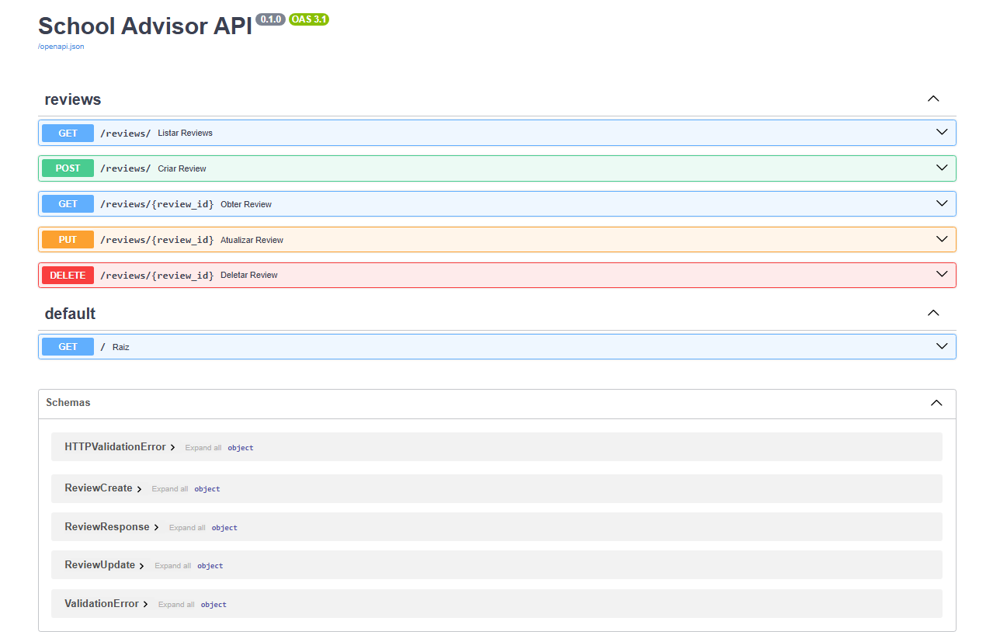

<div align="center">


# School Advisor — CRUD de Avaliações de Escolas

Aplicação **full-stack** para cadastrar, listar, editar e excluir avaliações de escolas.
Construída com **FastAPI**, **Streamlit** e **PostgreSQL**, totalmente **orquestrada com Docker Compose**.


</div>

---

## 📖 Sobre o projeto

O **School Advisor** permite que pais e responsáveis avaliem escolas — atribuindo uma **nota de 1 a 5**, um **título** e um **comentário**. O sistema demonstra, ponta a ponta, as quatro operações de um **CRUD** (Create, Read, Update, Delete) em uma arquitetura profissional de três camadas.

Durante o desenvolvimento, o banco foi populado com **150 avaliações sintéticas** de **30 escolas** a partir de um CSV (veja [Sobre os dados](#sobre-os-dados)).

---

## 🏗️ Arquitetura

A aplicação é dividida em três serviços independentes, cada um no seu próprio contêiner. O frontend **nunca** acessa o banco diretamente — toda comunicação passa pela API.

```
┌─────────────────┐      HTTP       ┌─────────────────┐      SQL        ┌─────────────────┐
│                 │  ───────────►   │                 │  ───────────►   │                 │
│    Streamlit    │                 │     FastAPI     │                 │   PostgreSQL    │
│   (frontend)    │  ◄───────────   │    (backend)    │  ◄───────────   │      (db)       │
│   :8501         │      JSON       │   :8000         │     ORM         │   :5432         │
└─────────────────┘                 └─────────────────┘                 └─────────────────┘
      Interface                        API REST                            Banco de dados
```

| Camada | Tecnologia | Responsabilidade |
|--------|-----------|------------------|
| **Frontend** | Streamlit | Interface web: formulários, tabelas, métricas |
| **Backend** | FastAPI + SQLAlchemy + Pydantic | API REST, validação e regras de negócio |
| **Banco** | PostgreSQL 16 | Persistência dos dados |

---

## 🛠️ Stack & boas práticas

- **FastAPI** com `APIRouter`, injeção de dependência (`Depends`) e `response_model`.
- **SQLAlchemy ORM** — modelo declarativo, sessões e `get_db` como dependência.
- **Pydantic v2** — schemas separados para entrada (`Create`/`Update`) e saída (`Response`), com validação automática (ex.: nota entre 1 e 5).
- **PostgreSQL** em contêiner, com **healthcheck** (`pg_isready`) e volume persistente.
- **Docker Compose** — `depends_on` com `condition: service_healthy` garante a ordem de inicialização.
- **12-Factor** — configuração via variáveis de ambiente (`.env`), nada de credenciais no código.
- **Separação de responsabilidades** — cada arquivo com um papel claro (`models`, `schemas`, `crud`, `router`).

---

## 📂 Estrutura do projeto

```
CRUD/
├── backend/
│   ├── database.py        # Conexão, engine, SessionLocal, get_db
│   ├── models.py          # Modelo ORM (tabela reviews)
│   ├── schemas.py         # Schemas Pydantic (validação I/O)
│   ├── crud.py            # Funções de Create/Read/Update/Delete
│   ├── router.py          # Rotas da API REST
│   ├── main.py            # Ponto de entrada da FastAPI
│   ├── Dockerfile
│   └── requirements.txt
├── frontend/
│   ├── app.py             # Interface Streamlit (3 abas: listar / criar / editar)
│   ├── Dockerfile
│   └── requirements.txt
├── assets/                # Logo e imagens
├── docker-compose.yml     # Orquestração dos 3 serviços
├── .env                   # Variáveis de ambiente (NÃO versionado)
└── README.md
```

---

## 🚀 Como rodar

### Pré-requisitos
- [Docker](https://www.docker.com/) e Docker Compose instalados.

### Passo a passo

1. **Clone o repositório** e entre na pasta:
   ```bash
   git clone <url-do-repo>
   cd CRUD
   ```

2. **Crie o arquivo `.env`** na raiz (use os valores abaixo como exemplo):
   ```env
   POSTGRES_USER=schooladvisor
   POSTGRES_PASSWORD=schooladvisor123
   POSTGRES_DB=schooladvisor
   POSTGRES_HOST=db
   POSTGRES_PORT=5432
   ```

3. **Suba a aplicação** (build + start dos três serviços):
   ```bash
   docker compose up --build
   ```

4. **Acesse:**
   | Serviço | URL |
   |---------|-----|
   | 🖥️ Interface (Streamlit) | http://localhost:8501 |
   | 📚 Documentação da API (Swagger) | http://localhost:8000/docs |

5. **Para parar:**
   ```bash
   docker compose down
   ```
   > Os dados ficam salvos no volume `postgres_data` e persistem entre reinicializações.

### Sobre os dados

Num clone novo o banco **começa vazio** — as avaliações são cadastradas pela própria interface (aba *Nova avaliação*) ou pela API.

> ℹ️ Durante o desenvolvimento, o banco foi populado com **150 avaliações sintéticas** de 30 escolas, apenas para fins de demonstração.

---

## ⚡ A API com FastAPI

O coração da aplicação é uma **API REST** construída com **[FastAPI](https://fastapi.tiangolo.com/)** — um framework Python moderno, rápido e amplamente adotado no mercado. A API é a "ponte" entre a interface e o banco: ela recebe as requisições, **valida** os dados, conversa com o PostgreSQL e devolve respostas em **JSON**.

**Por que FastAPI?**

- **Validação automática** — combinada com o **Pydantic**, a API rejeita dados inválidos *antes* de chegarem ao banco. Ex.: uma nota fora do intervalo 1–5 é barrada com uma mensagem de erro clara, sem que eu precise escrever um único `if`.
- **Documentação gerada sozinha** — a partir do próprio código, a FastAPI cria uma página interativa (**Swagger UI**) onde dá pra **testar cada endpoint pelo navegador**, sem precisar de Postman ou `curl`.
- **Performance** — é um dos frameworks Python mais rápidos, por rodar de forma assíncrona sobre o ASGI (Uvicorn).
- **Padrões abertos** — segue o **OpenAPI 3.1** e o **JSON Schema**, padrões reconhecidos pela indústria.

Cada operação do CRUD corresponde a um **verbo HTTP**, a forma universal de comunicação na web:

| Operação CRUD | Verbo HTTP | Significado |
|---------------|-----------|-------------|
| **C**reate | `POST` | Criar um novo recurso |
| **R**ead | `GET` | Ler / consultar |
| **U**pdate | `PUT` | Atualizar |
| **D**elete | `DELETE` | Excluir |

### 📚 Documentação interativa (Swagger UI)

Com a aplicação no ar, acesse **http://localhost:8000/docs** para explorar e testar a API direto do navegador:

<div align="center">
  
</div>

> A FastAPI gera essa interface automaticamente a partir das rotas e dos schemas Pydantic — repare que cada verbo aparece com sua cor (GET azul, POST verde, PUT laranja, DELETE vermelho) e que os modelos de dados (`ReviewCreate`, `ReviewResponse`, `ReviewUpdate`) ficam listados em **Schemas**.

---

## 🔌 Endpoints da API

Base: `http://localhost:8000` — prefixo `/reviews`

| Método | Rota | Descrição |
|--------|------|-----------|
| `GET` | `/reviews/` | Lista as avaliações (paginação via `skip` e `limit`) |
| `GET` | `/reviews/{review_id}` | Busca uma avaliação pelo ID |
| `POST` | `/reviews/` | Cria uma nova avaliação → **201 Created** |
| `PUT` | `/reviews/{review_id}` | Atualiza uma avaliação (parcial) |
| `DELETE` | `/reviews/{review_id}` | Exclui uma avaliação |

### Exemplo — criar uma avaliação

```bash
curl -X POST http://localhost:8000/reviews/ \
  -H "Content-Type: application/json" \
  -d '{
    "inep_id": 35012345,
    "escola_nome": "Colégio São José",
    "review_score": 5,
    "review_comment_title": "Excelente!",
    "review_comment_message": "Equipe atenciosa e ótima estrutura."
  }'
```

---

## 📋 Modelo de dados (`reviews`)

| Campo | Tipo | Observação |
|-------|------|-----------|
| `review_id` | String (UUID) | Chave primária, gerada pelo servidor |
| `inep_id` | Integer | Código INEP da escola (indexado) |
| `escola_nome` | String | Obrigatório |
| `escola_endereco` | String | Opcional |
| `review_score` | Integer | Obrigatório, de 1 a 5 |
| `review_comment_title` | String | Opcional |
| `review_comment_message` | Text | Opcional |
| `reviewer_nome` | String | Opcional |
| `reviewer_email` | String | Opcional |
| `review_creation_date` | DateTime | Preenchido na criação |
| `review_answer_timestamp` | DateTime | Opcional |

---

## 🧱 Como o projeto foi construído

O projeto foi desenvolvido em **10 etapas incrementais**, do alicerce ao topo — cada camada testada antes de partir para a próxima:

| # | Etapa | Entregável |
|---|-------|-----------|
| 1 | **Estrutura de pastas** | Organização do projeto (`backend/`, `frontend/`, `assets/`) |
| 2 | **Banco de dados** | PostgreSQL em contêiner via Docker Compose, com healthcheck |
| 3 | **Conexão com o banco** | `database.py` — engine, sessão e dependência `get_db` |
| 4 | **Modelo ORM** | `models.py` — mapeamento da tabela `reviews` com SQLAlchemy |
| 5 | **Schemas Pydantic** | `schemas.py` — validação de entrada e saída de dados |
| 6 | **Operações CRUD** | `crud.py` — funções de criar, ler, atualizar e excluir |
| 7 | **Rotas da API** | `router.py` + `main.py` — endpoints REST com FastAPI |
| 8 | **Carga de dados** | Importação de 150 avaliações sintéticas para o banco |
| 9 | **Frontend** | `app.py` — interface em Streamlit (listar / criar / editar / excluir) |
| 10 | **Dockerização** | Orquestração dos 3 serviços com um único `docker compose up` |

> Essa abordagem incremental — **banco → conexão → modelo → validação → lógica → API → interface → deploy** — reflete o fluxo real de desenvolvimento de uma aplicação full-stack profissional.

---

<div align="center">

Desenvolvido por **Elen de Bona** 🎓

</div>
# meu_primeiro_CRUD
